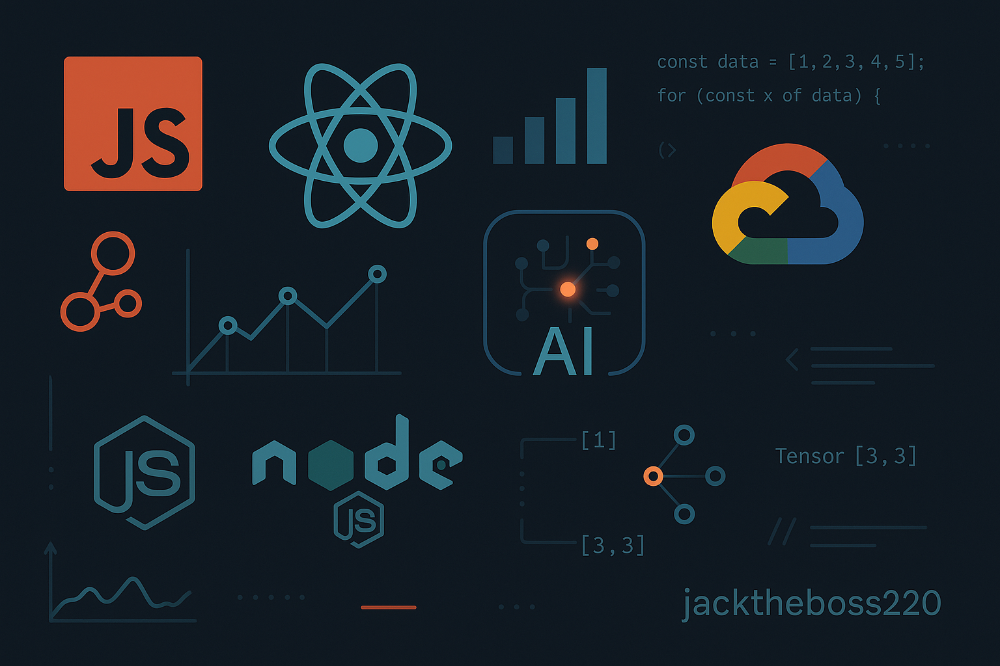

<h1>Hi 👋, I'm Mahesh Kumar</h1>

&nbsp;

&nbsp;

---

- 🏢 Currently working as **Cloud & Data Operations Engineer** at **BrandContext** (since Oct 2025)
- 🌱 Upskilling with **React.js**, focusing on building interactive UIs
- 🔧 Working with **Node.js**, **Puppeteer.js**, **Google APIs**, and **Express.js** for backend automation and data solutions
- 📊 Built **20+ Chart.js visualizations** (line, bar, grouped, stacked, combo) using Google Sheets data via Node.js + Express, deployed on **Google Cloud Run**
- 🧠 Skilled in **logic building**, **data scraping**, and **DOM manipulation**
- 🎓 MCA in Data Science & AI — Babu Banarasi Das University (BBDU)
- 💬 Ask me about: **JavaScript**, **Node.js**, **REST APIs**, and **automated data pipelines**
- ⚡ Fun fact: **I prefer code over conversation — let the logic do the talking.**

---

### 🚀 Featured Projects

| Project | Tech | ⭐ |
|:---|:---:|:---:|
| [WhatsAppBotMultiDevice](https://github.com/jacktheboss220/WhatsAppBotMultiDevice) — WhatsApp bot with utility & group management | `JavaScript` | 230 |
| [weather-app-training](https://github.com/jacktheboss220/weather-app-training) | `JavaScript` | 2 |
| [insta-downloader](https://github.com/jacktheboss220/insta-downloader) | `JavaScript` | — |
| [news-js](https://github.com/jacktheboss220/news-js) | `EJS` | — |
| [LeetCode](https://github.com/jacktheboss220/LeetCode) — random LeetCode solutions | `JavaScript` | — |

> "The quieter you become, the more you can hear — in code and in life." 🧘‍♂️

---

### 📫 Connect with Me

---

### 🛠️ Tech Stack

**Languages**

**Backend & Databases**

**Frontend & Visualization**

**Cloud, DevOps & Tools**

---

### 📊 GitHub Stats & Graphs

  

  

  

  

### 🐍 Contribution Snake

---

### 🧩 LeetCode Stats

  

---

<i>⭐️ Always learning, always building.</i>

